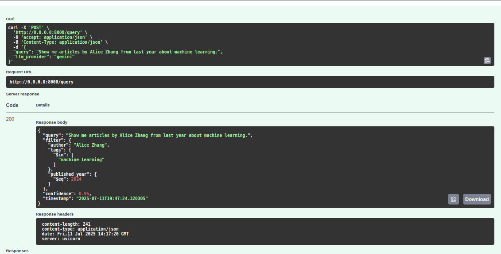
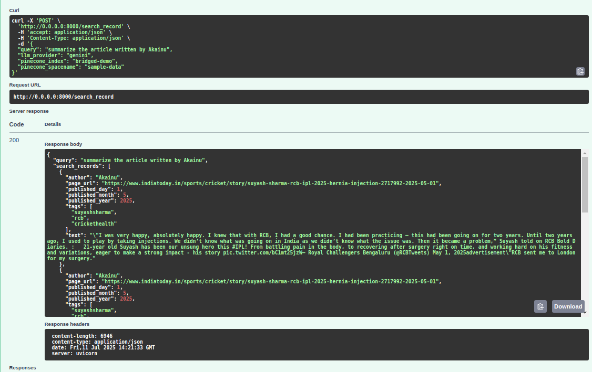
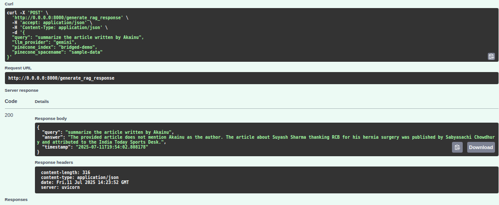

# AI-Powered Pinecone Search and Query Parser Agent

## Overview

This project provides an AI-powered API for natural language querying and retrieval-augmented generation (RAG) over a Pinecone vector database. It leverages LLMs (currently Google Gemini) to parse user queries, generate Pinecone search filters, and return relevant records or context-aware answers.

## Features
- **Natural Language Query Parsing:** Converts user queries into structured Pinecone filters using LLMs.
- **Semantic Search:** Retrieves relevant records from Pinecone based on parsed filters and semantic similarity.
- **RAG (Retrieval-Augmented Generation):** Uses retrieved records as context to generate answers to user queries.
- **FastAPI-based API:** Exposes endpoints for query parsing, record search, and RAG response generation.
- **Docker Support:** Easily deployable with Docker.

## Directory Structure
```
bridged_demo/
├── Agents/                # Query parsing and Pinecone agent logic
├── LLMProvider/           # LLM provider abstraction and Gemini integration
├── Notebooks/             # Jupyter notebooks for data/index prep
├── Resources/             # Sample data (CSV)
├── SampleOutputs/         # Example outputs and screenshots
├── prompts/               # Prompt templates for LLMs
├── app.py                 # FastAPI app (main API entrypoint)
├── main.py                # Example script for direct agent usage
├── requirements.txt       # Python dependencies
├── Dockerfile             # Docker build file
```

## Setup

### 1. Clone the repository
```bash
git clone <repo-url>
cd bridged_demo
```

### 2. Install dependencies
```bash
python3 -m venv .venv
source .venv/bin/activate
pip install --upgrade pip
pip install -r requirements.txt
```

### 3. Environment Variables
Create a `.env` file in the project root with the following variables:
```env
GEMINI_API_KEY=your-gemini-api-key
PINECONE_API_KEY=your-pinecone-api-key
```

### 4. Prepare Pinecone Index & Data
- Use the notebook in `Notebooks/PreparePineconeIndex.ipynb` to create a Pinecone index and upsert sample data from `Resources/sample_data - itg_sports.csv.csv`. This notebook will create index with name `bridged-demo` and namespace `sample-data` so use this name while using API.

## Running the API

### Locally
```bash
uvicorn app:app --reload --host 0.0.0.0 --port 8000
```

### With Docker
```bash
docker build -t pinecone-query_processor_rag-agent .
docker run -p 8000:8000 --env-file .env pinecone-query_processor_rag-agent
```

### Try API 
checkout API documentation here after starting server here http://0.0.0.0:8000/docs

## API Endpoints

- `POST /query`  
  Convert a natural language query to a Pinecone filter.
  - **Request:** `{ "query": "...", "llm_provider": "gemini" }`
  - **Response:** `{ "query": ..., "filter": ..., "confidence": ..., "timestamp": ... }`

- `POST /search_record`  
  Search Pinecone for records matching the query.
  - **Request:** `{ "query": "...", "llm_provider": "gemini", "pinecone_index": "...", "pinecone_spacename": "..." }`
  - **Response:** `{ "query": ..., "search_records": [...], "timestamp": ... }`

- `POST /generate_rag_response`  
  Get a context-aware answer using RAG.
  - **Request:** `{ "query": "...", "llm_provider": "gemini", "pinecone_index": "...", "pinecone_spacename": "..." }`
  - **Response:** `{ "query": ..., "answer": ..., "timestamp": ... }`

- `GET /`  
  API info and supported endpoints.

## Screenshots & Examples

Below are example screenshots demonstrating the API in action:

### 1. Query Parsing Example

*The API parses a natural language query and generates a structured Pinecone filter.*

### 2. Record Search Example

*The API searches Pinecone and returns relevant records based on the parsed query.*

### 3. RAG Response Example

*The API uses retrieved records as context to generate a semantic answer to the user query.*

## Sample Data
- The file `Resources/sample_data - itg_sports.csv.csv` contains example sports news articles with fields: `pageURL`, `title`, `publishedDate`, `author`, `tags`.

## LLM Provider
- Currently supports Google Gemini (see `LLMProvider/GeminiProvider.py`).
- You may need to set up Google GenAI credentials depending on your environment.

## Future Goals
- **Support for More LLM Providers:** Plan to add additional LLM providers (e.g., OpenAI, Anthropic, etc.) in the `LLMProvider` directory for greater flexibility and capability.
- **Summarization During Insertion:** Integrate LLM-based summarization during data insertion into Pinecone to store concise, focused summaries for improved search and RAG performance.

